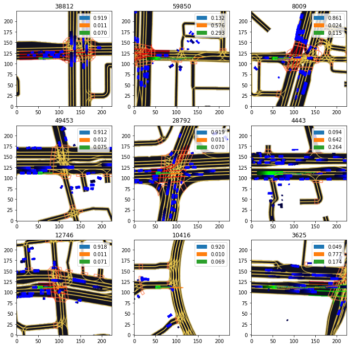
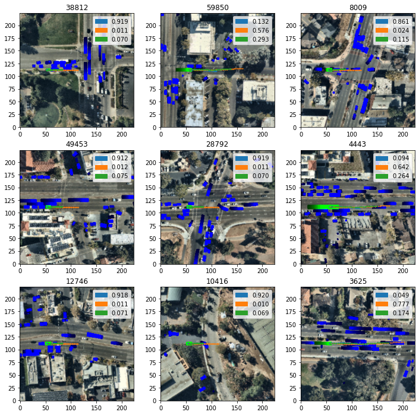
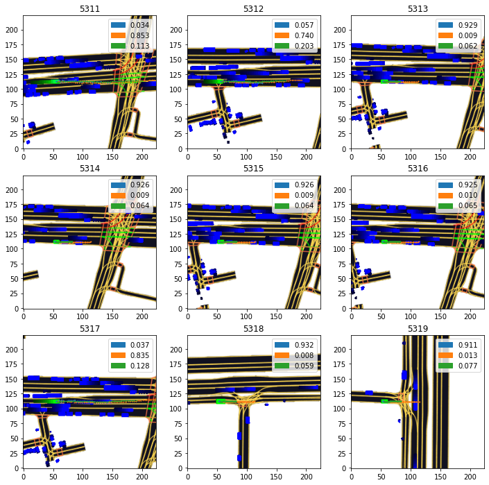

# Direction-prediction-for-self-driving-cars
### This projct aims at predicting direction of movement of other vehicles other than ego vehicle. 
### The beutiful l5kit is used for data and representation . Models are built using pytorch and trained on K80 GPU .
### New methods are being tesed on the datsets and will be updated to this repositories as soon as its experiment is finished
### Tools: Pytorch, L5kit
### results

#
#

#
#

